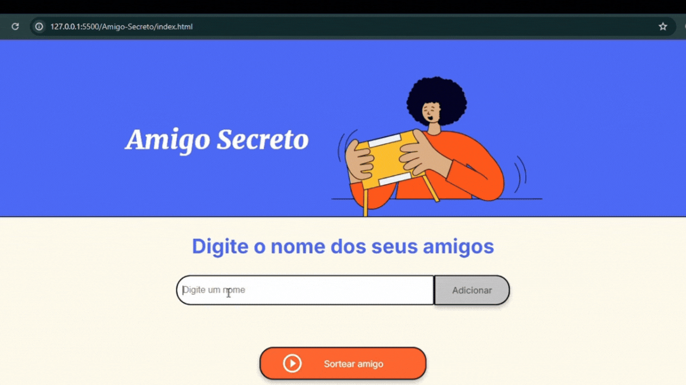

# Amigo Secreto - Descrição do Projeto

Este projeto está sendo desenvolvido no **Challenge ONE**, onde o desafio é criar uma aplicação interativa para sortear um amigo de forma aleatória.
A aplicação permite que os usuários preencham um campo de texto com os nomes dos amigos e, em seguida, realizem um sorteio para descobrir quem será o "Amigo Secreto".

# :hammer: Funcionalidades do projeto

- `Funcionalidade 1`: O usuário digita os nomes dos amigos em um campo de texto e em seguida clica no botão **"Adicionar"**.
- `Funcionalidade 2`: Cada nome inserido aparecerá automaticamente em uma lista visível na tela.
- `Funcionalidade 3`: Quando todos os nomes estiverem cadastrados, o usuário pode clicar no botão **"Sortear amigo"**.
- `Funcionalidade 4`: A aplicação escolherá aleatoriamente um dos nomes e exibirá o resultado de forma dinâmica e divertida.

# :computer: Resultado

# :heavy_check_mark: Tecnologias utilizadas

  
